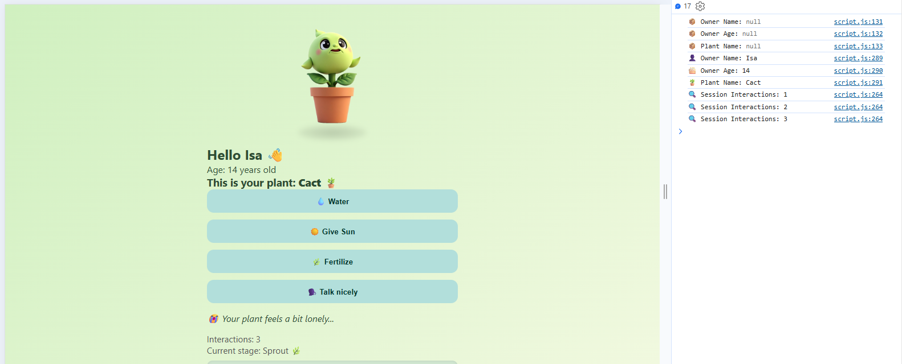

#  Plant Growth Simulator

Este proyecto es un **simulador interactivo** de crecimiento de plantas, creado para practicar **manipulación del DOM**, **almacenamiento en el navegador** (Local Storage y Session Storage), y aplicar buenas prácticas de desarrollo frontend.

---

## Funcionalidades principales

* Formulario de bienvenida para capturar nombre, edad y nombre de la planta  
* Almacenamiento de datos en **Local Storage**  
* Recuperación y visualización automática al recargar la página  
* Interacciones (regar, dar sol, fertilizar, hablar) con la planta  
* Contador de interacciones usando **Session Storage**  
* Evolución de la planta a través de 7 etapas de crecimiento   
* Barra de progreso visual  
* Sistema de insignias al lograr ciertas metas   
* Temporizador de inactividad que entristece a la planta  
* Botón para reiniciar toda la experiencia  

---

##  Cómo usar

1. Abre el archivo `index.html` en tu navegador.
2. Llena el formulario con tu nombre, edad y el nombre de tu planta.
3. ¡Interactúa con tu plantita! Cada acción la ayuda a crecer.  
4. Observa cómo progresa, gana insignias y responde a tu cariño.  
5. Puedes reiniciar el juego con el botón "Reset".  

---

## 🧠 Tecnologías utilizadas

- HTML5
- CSS3
- JavaScript (ES6+)
- Local Storage y Session Storage del navegador

---

## 📂 Estructura del proyecto

```
📁 Entregable/
│
├── 📁 assets/
│   ├── 📁 img/           → Imágenes de la planta en sus etapas y estados
│   └── 📁 sounds/        → Efectos de sonido para cada interacción
│
├── 📄 index.html         → Página principal con el formulario de ingreso
├── 📄 plant.html         → Vista principal de cuidado de la planta
├── 📄 styles.css         → Estilos personalizados para toda la aplicación
└── 📄 script.js          → Lógica del simulador y manejo del DOM
```

---

##  Captura



---

## 👩‍💻 Autora

Desarrollado con 💚 por Vanesa Carrillo

---

¡Gracias por visitar este pequeño jardín digital! 🌼